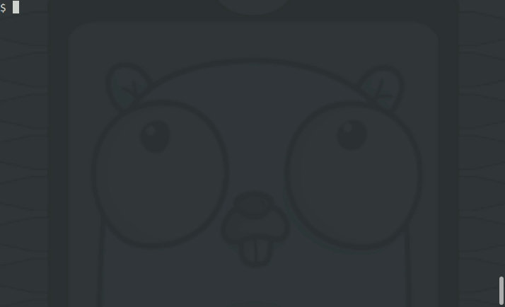

# tinygo-autocmpl

`tinygo-autocmpl` adds bash/zsh/clink completion to tinygo  

`tinygo-autocmpl` only support bash, zsh and clink at the moment, but other shells like fish should be able to do the same.  
Your contributions are welcome.  

## Description



## Usage

You can enable autocompletion by setting the following to `~/.bashrc` etc.  

```
# bash
$ eval "$(tinygo-autocmpl --completion-script-bash)"

# zsh
$ eval "$(tinygo-autocmpl --completion-script-zsh)"

# clink (windows)
$ tinygo-autocmpl --completion-script-clink > %LOCALAPPDATA%\clink\tinygo.lua
```

You can customize the auto-completion of the -target flag in the following way  
This allows you to use only your own targets, for example.  

```
$ cat ~/.tinygo.targets 
feather-m4
xiao

$ eval "$(tinygo-autocmpl --targets ~/.tinygo.targets --completion-script-bash)"

$ tinygo flash --target 
feather-m4  xiao        
```

To add wioterminal to the autocompletion candidates, do this

```
$ echo wioterminal >> ~/.tinygo.targets 

$ cat ~/.tinygo.targets
feather-m4
xiao
wioterminal

$ tinygo flash --target 
feather-m4   wioterminal  xiao         
```

## Installation

```
go get github.com/sago35/tinygo-autocmpl
```

### Environment

* go

I tested tinygo-autocmpl in the following environments.

* ubuntu
    * bash
    * zsh
* windows
    * bash (git for windows)
    * clink (https://mridgers.github.io/clink/)

## Notice

## Author

sago35 - <sago35@gmail.com>
